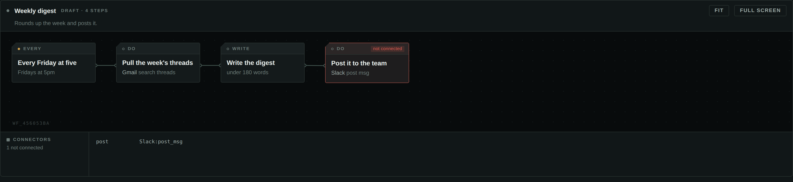
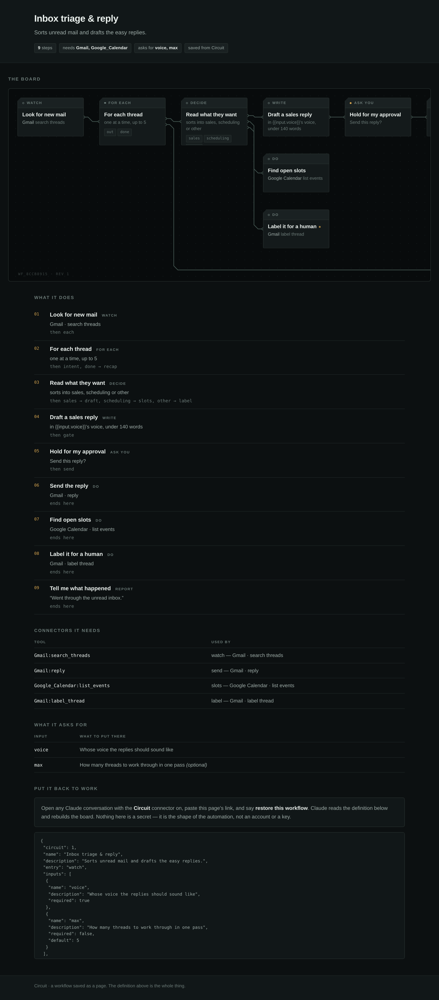
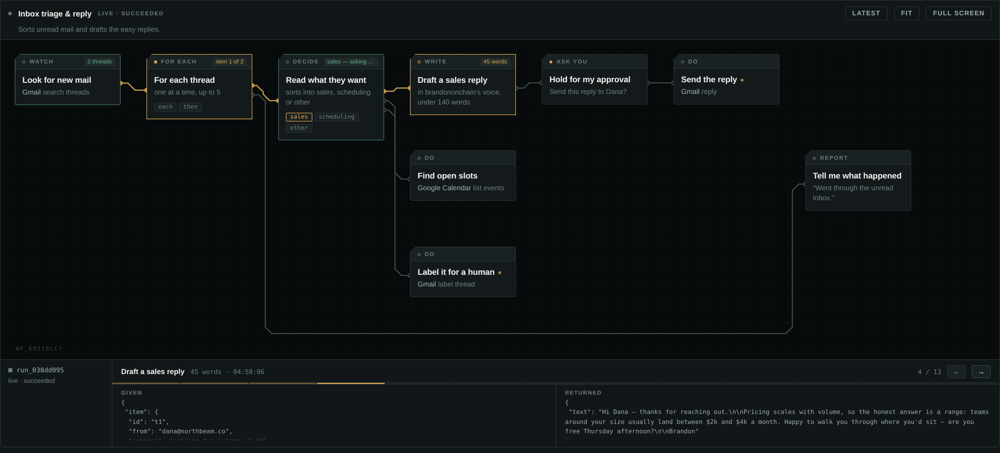
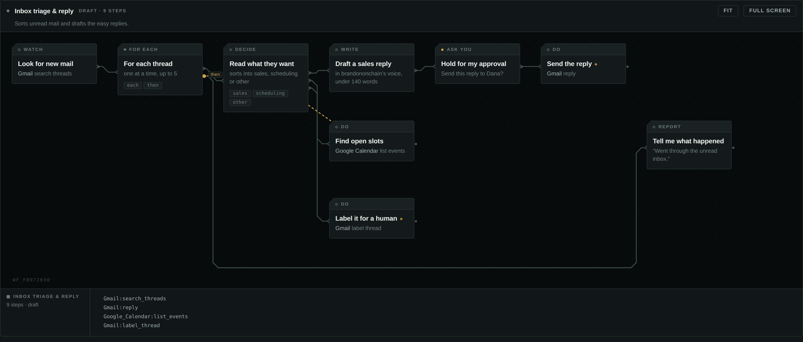
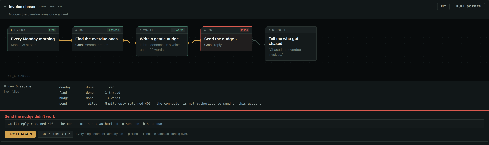

<div align="center">

# Circuit

**A visual workflow builder that lives inside a Claude conversation — and runs on the connectors you already have.**

You describe an automation in chat. Claude lays the board while you watch, you edit it by hand, and then Claude runs it one step at a time using *your* Gmail, your Slack, your Airtable. Circuit never asks for a single credential.

[](https://modelcontextprotocol.io)
[](https://modelcontextprotocol.io/seps/1865-mcp-apps-interactive-user-interfaces-for-mcp)
[](LICENSE)
[](https://www.typescriptlang.org/)


</div>

---

## The idea

Every workflow builder makes you learn its canvas: drag a node, open a panel, map a field, repeat. Circuit inverts that. **The conversation is the editor.** You say what you want; the board appears; you drag a chip only when you disagree with where Claude put it.

Three things make it work.

**It streams.** While Claude is still emitting the `circuit_design` call, the host forwards `ui/notifications/tool-input-partial`. Each time a step object closes in the partial JSON, the board places that chip. The build animation is the model's output arriving — not a canned sequence.

**It owns nothing.** Circuit has no Gmail integration, no OAuth flow, no API keys, no secrets at rest. A step just names a tool from *your* tool list — `Gmail:search_threads`, `Slack:send_message`, `Airtable:create_records_for_table` — and Claude makes the call. Anything you can connect to Claude, Circuit can orchestrate on day one. Claude tells Circuit once what it can reach, and from then on a wrong tool name is caught while the board is still being drawn.

**It drives.** At run time Circuit is a state machine, not an executor. `circuit_run` hands Claude exactly one directive; Claude does that one thing and reports back with `circuit_step`; the board updates and the next directive comes out. Branching, filtering and looping never leave the server, so a nine-step workflow with a loop is nine deterministic hops instead of one long improvisation.

```
        you ──"triage my inbox and draft the easy replies"──▶ Claude
                                                                │
                                        circuit_design (streams) │
                                                                ▼
   ┌───────────────────────────────── the board ─────────────────────────────────┐
   │   watch ─▶ each ─▶ classify ─┬─▶ write ─▶ approve ─▶ send                   │
   │                              ├─▶ find slots                                 │
   │                              └─▶ label                                      │
   └─────────────────────────────────────────────────────────────────────────────┘
                                                                │
                        circuit_run ─▶ one directive at a time  │
                                                                ▼
      Claude calls YOUR connectors ──▶ Gmail · Slack · Calendar · Airtable · …
```

---

## What a session looks like

> **You:** Watch my inbox, work out what each unread message wants, draft replies to the sales ones, and don't send anything without showing me first.

Claude reads `circuit_catalog`, then makes one `circuit_design` call. The board draws itself chip by chip as the arguments stream in. Then:

> **You:** Run it.

```jsonc
// circuit_run  →
{ "act": "call_tool", "stepId": "watch",
  "tool": "Gmail:search_threads",
  "arguments": { "q": "in:inbox is:unread -from:me", "max_results": 5 },
  "expect": "Call that tool, then send the whole result back with circuit_step." }
```

Claude calls its own Gmail tool, reports the threads, and Circuit hands back the next directive — a classify, then a draft, then:


The run stops. You edit the draft in the box and press **Approve & continue** — the board calls back into the server, the edited text replaces the draft in the run data, and the next directive is the send, with your words in it. Then the loop turns over and does the next thread.


## Connectors are checked, not assumed

Naming a tool as a plain string has one sharp edge: get the string wrong and nothing complains until a run is halfway through and a directive points at something Claude cannot call.

`circuit_bind` closes it. Claude reports the tools it actually has, once; Circuit remembers them and checks every step against that list — the same treatment an unknown *step type* already gets, extended to connectors.



The step is saved either way — a wrong chip is much easier to see than to describe — but it is marked on the board, listed in the console, and `circuit_run` refuses to start until it's fixed:

```
One step names a connector tool you do not have:
  post: 'Slack:post_msg' is not in your tool list — did you mean 'Slack:send_message'?
Fix the tool names, or call circuit_bind again if the user has connected something since.
```

Suggestions come from bigram similarity weighted toward the connector: a near-miss inside `Gmail:` scores far above a closer spelling in some other service, because that is almost always what happened. If nothing scores well enough, you get no suggestion rather than a confident wrong one.

Binding is optional. Without it Circuit says plainly that it could not check, and gets out of the way.

## One board can call another

`flow.call` runs a whole other workflow from inside this one and carries its
result back. The sub-workflow gets its **own step namespace**, so ids can never
collide, its own inputs, and its own `trigger` — only what `returns` names comes
out:

```jsonc
{ "id": "sub", "type": "flow.call", "title": "Draft and approve",
  "config": { "workflowId": "wf_09c583c7",
              "input": { "who": "{{steps.find.threads.0.from}}" },
              "returns": "steps.write.text" } }
```

Downstream, `{{steps.sub}}` is that text. Directives from inside the
sub-workflow reach Claude exactly as they would at the top level, so a gate deep
inside one still stops the whole run and asks.

A workflow that calls itself — directly or round a longer loop — is refused
while it's being drawn, naming where the loop closes:

```
wf_09c583c7 → wf_0e61662e → wf_09c583c7 calls itself.
```

## Workflows you can keep

A board lives in a conversation, and conversations end. `circuit_export` writes a
workflow out as a **standalone page** — the board drawn out, what every step does
in plain English, the connectors it needs, and the definition itself — which
Claude publishes as an artifact you own. It's yours across conversations, and you
can share it.



No scripts, no external anything: the board is laid out server-side into absolute
divs and an SVG, so it draws identically forever. Fixed chip heights are what
make that possible — geometry has to be knowable without a browser to measure it
in.

Paste that page's link into any future conversation and say **restore this
workflow**. `circuit_import` finds the definition inside the page — you don't
have to extract anything — and rebuilds the board as a draft. Tool names come
back exactly as saved, so Circuit re-checks them against *your* connectors, which
is what makes a workflow safe to accept from someone else.

There are three starter boards in [`examples/`](examples/) in the same format.

## Workflows can take input

A board that hardcodes a name, an address or a search term serves exactly one
case. Declare inputs instead:

```jsonc
"inputs": [
  { "name": "voice",   "description": "Whose voice the replies should sound like" },
  { "name": "limit",   "description": "How many threads per pass", "required": false, "default": 5 }
]
```

They're reachable everywhere as `{{input.voice}}`, and `circuit_run` refuses to
start without the required ones, naming what it needs so Claude knows to ask
rather than guess. This is what turns a saved workflow from a snapshot of your
setup into something someone else can actually use.

## Runs are replayable

A run records what every step was **handed** and what came **back**, so a
finished run is a timeline you can walk rather than a log you have to read.



Press **Replay** and the board shows the run as it stood at that moment — chips
that hadn't happened yet are simply idle, the current one is lit, and the traces
carry the payload only as far as it had actually got. Arrow keys step, the bar
seeks, Escape returns to the end.

Payloads are clipped on the way in, keeping the *shape* of a value while dropping
the bulk: a 9 kB body plus forty rows stores as about 2.5 kB, still showing you
it was forty rows of `{i, note}` with the first five intact. The timeline is
capped at 240 moments and drops the oldest with a marker, so a loop over a large
inbox can't grow a run without limit.

This is the debugging tool. "It sent the wrong thing" stops being a mystery when
you can look at the exact arguments the send step was given, three iterations
into a loop.

## A test run doesn't send the email

`mode: "test"` used to label the run and nothing else, which is worse than having
no test mode at all — the word promises something the code doesn't deliver.

Circuit can't know what a connector tool does, so a step declares it. Where it
hasn't, the verb decides: `send`, `post`, `create`, `delete`, `reply` write;
`search`, `list`, `get`, `read` don't. A step that writes comes back as a
different directive in a test run:

```jsonc
{ "act": "preview", "stepId": "reply", "tool": "Gmail:reply",
  "arguments": { "thread_id": "t9", "body": "Hi Dana — pricing scales with…" },
  "expect": "DO NOT call this tool. This is a test run and the step writes. Show the
             user the tool name and these exact arguments…" }
```

Everything upstream runs for real, so the draft you're reviewing is the draft
that would actually go out — with the templates resolved, which is where most
workflow bugs live.

The same flag pays off twice. `circuit_arm` refuses a workflow where a write has
no approval gate on every path to it, because *fires unattended and sends things
nobody read* should be a decision, not an oversight:

```
This would go live with a step that writes and no approval gate in front of it:
  reply: Gmail:reply

Add a gate.approve upstream with circuit_patch, or — if the user has seen a test
run and explicitly wants it to fire unattended — call circuit_arm again with force.
```

Chips that write carry a small dot after the title, so the ones that can do
something irreversible are visible at a glance.

## The board is an editor

Pull a wire out of any output port and drop it on the chip it should reach.
Hover a wire and it offers to cut itself.



Both go through app-only tools, so rewiring a board never wakes the model or
costs a turn — the same trick that makes dragging a chip free.

## Armed is a claim Circuit can check

Circuit has no scheduler. An armed workflow depends on someone creating a
scheduled task that calls it, and the failure is silent: the board says "armed"
for three weeks while nothing has called it once.

So `circuit_arm` hands over the exact prompt to schedule, and asks for the task
id back:

```
Friday digest is armed on `0 22 * * 5` (about every 7 days).

Circuit has no scheduler of its own, so nothing will call this until you create a
scheduled task. Create one on that cron with exactly this prompt:

Run Circuit workflow wf_cbb0b7fe ("Friday digest"): call circuit_run with
workflowId "wf_cbb0b7fe", then follow each directive it returns until you get
{"act":"done"}.
```

`circuit_health` then checks the claim against reality — whether a task was ever
recorded, and whether the thing has run recently enough for its own schedule:

```
✕ wf_cbb0b7fe  Friday digest
    armed on "Fridays at 5pm" but no scheduled task was ever reported back.
    Create one and record it with circuit_scheduled, or nothing will ever call this.
```

Overdue is judged at **two windows late**, measured against the *widest* gap in
the schedule rather than the average. A weekdays-at-one workflow fires 24 hours
apart four times and then 72 over the weekend; judging it on the 24 would call
every Sunday an outage.

## Every workflow has a second path

A step fails. The connector 403s, the record isn't there, the API is having a
day. Circuit makes that a designed outcome rather than a dead end — each step
carries its own policy:

| `onError.do` | What happens |
| --- | --- |
| `stop` *(default)* | The run halts here and keeps everything it had. Nothing after it ran. |
| `skip` | This path ends; the rest of the run — the next loop item, say — carries on. |
| `retry` | Circuit hands Claude the same directive again, up to `attempts` times. |
| `route` | The run leaves by the **error** port, so the board can show a fallback. |



A stopped run is not a lost one. It keeps its data, its queue, and its place, so
`circuit_resume` hands out the same directive again once you've fixed the cause —
or steps over it with `skip: true`. That distinction matters: everything before
the failure already happened, and re-running the whole workflow would repeat
every side effect it had.

The corresponding instruction to Claude is blunt, because this only works if it's
honest: **report the failure, never substitute a plausible result.** A made-up
success is the one thing that defeats the entire mechanism.

---

## What Circuit speaks

Built on the official `@modelcontextprotocol/sdk`, negotiating protocol
`2025-06-18`, with MCP Apps riding on top per SEP-1865 (`2026-01-26`).

| | |
| --- | --- |
| **Tools** | 23 |
| **Prompts** | `circuit-build` · `circuit-open` · `circuit-save` · `circuit-check` |
| **Resources** | the `ui://` board, plus `circuit://workflow/{id}` and `circuit://run/{id}` |
| **Completions** | workflow and run ids, on both the templates and the prompt arguments |
| **Transports** | Streamable HTTP (stateless) and stdio |
| **Auth** | OAuth 2.1 — metadata, dynamic registration, PKCE, refresh |

Circuit advertises `tools`, `resources` and `prompts` **without** `listChanged`.
The SDK turns that flag on for anything you register, but a stateless Streamable
HTTP session has no channel to push a notification down, and a capability that
can never fire leaves a client waiting for something that is never coming. It
goes back on the day sessions become stateful, not before.

### Running it locally over stdio

```jsonc
// claude_desktop_config.json
{ "mcpServers": {
    "circuit": { "command": "npx", "args": ["-y", "circuit-mcp"] } } }
```

Same server, same tools; the workspace comes from the environment rather than a
token, because there is nobody else on the other end of a pipe.

---

## Signing in

Set `CIRCUIT_OWNER_KEY` and Circuit becomes an OAuth 2.1 authorization server as
well as a resource server. Leave it unset and the server runs open, which is what
you want while developing and never what you want on the internet.

```
GET  /.well-known/oauth-protected-resource   →  where to authorize
GET  /.well-known/oauth-authorization-server →  the endpoints
POST /oauth/register                         →  dynamic client registration
GET  /oauth/authorize                        →  consent, then the owner key
POST /oauth/token                            →  code + PKCE, and refresh
```

**Nothing in the flow is stored.** The client registration, the authorization
code and both tokens are signed blobs rather than database rows — which is not
cleverness for its own sake: Circuit is built to run on serverless, where a cold
start would otherwise lose a registration mid-handshake, and where "the auth
server has state" quietly means you need a database before you can log in.

The two places that would be wrong to fake are handled properly. Authorization
codes are single-use, enforced by recording the id the first time it is redeemed.
And revocation says what it actually does:

```jsonc
{ "revoked": false,
  "detail": "Circuit's tokens are signed, not stored. Rotate CIRCUIT_SECRET to
             invalidate every token at once." }
```

The identity is the deployment's owner key — one key, one workspace. That is the
honest shape for something you host for yourself, and it leaves room for the real
thing: the subject is already carried through every token, so adding accounts
later changes who issues a subject, not how anything downstream reads one.

---

## Quick start

```bash
git clone https://github.com/brandononchain/circuit-mcp.git
cd circuit-mcp
npm install
npm run dev            # → http://localhost:8787/mcp
```

Then in Claude: **Settings → Connectors → Add custom connector**, paste `http://localhost:8787/mcp`, and ask for an automation. That is the whole setup — there is nothing to authorize, because Circuit reaches nothing on its own.

For a public URL without a deploy, `npx localtunnel --port 8787` or `ngrok http 8787` is enough to try it from claude.ai.

---

## The step kit

Twelve types. Four are settled by Circuit itself; the rest become directives.

| On the chip | Type | Who does it | What it is |
| --- | --- | --- | --- |
| **when** | `trigger.ask` | you | Runs when you ask. The default. |
| **every** | `trigger.schedule` | you | Stores a cron. Pair it with one of your scheduled tasks calling `circuit_run`. |
| **watch** | `trigger.watch` | Claude | Calls a connector tool to look for new items, and starts the run on what it finds. |
| **do** | `tool.call` | Claude | **The workhorse.** Names a tool from your connectors and the arguments to call it with. |
| **decide** | `model.classify` | Claude | Reads the input and picks one label. The label becomes the output port. |
| **write** | `model.write` | Claude | Drafts text. Sends nothing — a later **do** step does that. |
| **read** | `model.extract` | Claude | Pulls named fields out of the input as structured data. |
| **only if** | `logic.filter` | **Circuit** | Stops the path unless the conditions hold. |
| **route** | `logic.branch` | **Circuit** | Routes on a value it already has. |
| **for each** | `logic.each` | **Circuit** | Runs everything downstream once per item, with a hard limit. |
| **run** | `flow.call` | **Circuit** | Runs another workflow and carries back what its `returns` names. |
| **all of** | `logic.branches` | **Circuit** | Fans out to several branches and continues at `join` once every one has finished. Set `together` and every branch goes out in one directive, answered in a single turn. |
| **ask you** | `gate.approve` | you | Parks the run and shows you an editable preview on the board. |
| **report** | `note.say` | Claude | Reports back in the conversation. |

The left column is what you actually see. A chip says what it *does* — `model.classify`
is a type name, **decide** is a thing a person recognizes — and the type only appears
when you select the chip.

Nothing here is Gmail-shaped, or Slack-shaped. `tool.call` is the integration layer, and its surface is whatever you have connected.

## Writing a workflow

Steps are plain objects. Wires are named by the port they leave from, which is how a classify fans out:

```jsonc
{
  "id": "intent",
  "type": "model.classify",
  "title": "Read what they want",
  "config": {
    "labels": ["sales", "scheduling", "other"],
    "input": "item",
    "instructions": "Pricing questions are sales."
  },
  "next": [
    { "port": "sales",      "to": "draft" },
    { "port": "scheduling", "to": "slots" },
    { "port": "other",      "to": "label" }
  ]
}
```

Anywhere a string appears in a step's config, `{{…}}` reaches into the run's live data and Circuit substitutes it *before* the directive ever reaches Claude:

| Template | Resolves to |
| --- | --- |
| `{{trigger.subject}}` | the payload the run started with |
| `{{steps.draft.text}}` | what an earlier step returned |
| `{{item.id}}` | the current item inside a `logic.each` loop |

```jsonc
{ "id": "send", "type": "tool.call", "title": "Send the reply",
  "config": { "tool": "Gmail:reply",
              "arguments": { "thread_id": "{{item.id}}", "body": "{{steps.draft.text}}" } } }
```

A whole-string template keeps its real type — `"{{steps.search.threads}}"` hands over the array, not its JSON.

## The tool surface

Thirteen tools, one capability each. Three are invisible to the model.

| Tool | Visible to | What it does |
| --- | --- | --- |
| `circuit_catalog` | model | Step types and their config keys. Read before designing. |
| `circuit_bind` | model | Reports the connector tools Claude can actually call. |
| `circuit_tools` | model | What Circuit believes you can reach, and when it was told. |
| `circuit_design` | model + app | Draws a whole workflow. **Streams.** |
| `circuit_patch` | model + app | Edits an existing board without discarding your layout. |
| `circuit_open` · `circuit_list` | model | Reads. |
| `circuit_run` | model + app | Starts a run, returns the first directive. |
| `circuit_step` | model + app | Reports a result — or an `error` — and returns the next directive. |
| `circuit_resume` | app + model | Picks a failed run back up, retrying or skipping the step that broke. |
| `circuit_runs` | model + app | History. |
| `circuit_export` | model | Writes the workflow out as a page to publish as an artifact. |
| `circuit_import` | model + app | Rebuilds a saved workflow from that page, or from JSON. |
| `circuit_arm` · `circuit_disarm` | model + app | Marks a workflow live, and hands over the exact prompt to schedule. |
| `circuit_scheduled` | model + app | Records the scheduled task that calls an armed workflow. |
| `circuit_health` | model | Which armed workflows have quietly stopped firing. |
| `circuit_answer` | app + model | Approve or reject a held gate, with edits. |
| `circuit_move` | **app only** | Persists a drag. Invisible to the model, so a nudge never costs a turn. |
| `circuit_wire` · `circuit_unwire` | app + model | Connect and cut, from the canvas or from chat. |
| `circuit_set_enabled` · `circuit_rename` | app + model | Small edits from either side. |

`circuit_move` is the reason the board feels like a canvas rather than a picture: `visibility: ["app"]` keeps it out of the model's tool list entirely, so dragging a chip writes to the server without waking Claude.

---

## How it fits together

```
Claude ──tools/call──────────────▶ Circuit MCP ──▶ storage (Supabase or memory)
   ▲                                    │
   │  directives, one at a time         │  ui://circuit/board.html
   │                                    ▼
   └──── calls YOUR connectors ◀── the board ──tools/call (app-only)──▶ Circuit MCP
```

```
src/
  graph.ts              workflow + run types, and the board layout
  registry.ts           the twelve step types: schema, summary, and who performs them
  engine/run.ts         the walker — ports, filters, loops, gates, resume
  server.ts             the MCP tool surface and the ui:// resource
  http.ts               one handler: /mcp, /health
  board.ts              what the canvas gets, and what the model reads back
  store/                Store interface · in-memory · Supabase over PostgREST
  app/board.src.html    the board's markup and visual system
  app/app.ts            the board's logic
  app/bridge.ts         an 11 kB MCP Apps view client (the SDK's is 300 kB)
scripts/
  build-app.mjs         inlines the app into a single self-contained ui:// resource
  build-output.mjs      Vercel Build Output API v3
  harness.ts            a local host, running the OFFICIAL AppBridge
  expect.mjs            the assertion harness every check script uses
  smoke.mjs             drives a full run over the wire
  trace-check.mjs       golden traces + step coverage for every example
  scenarios.mjs         what "running correctly" means for each example
```

### Reading a chip

```
 ╭─────────────────────────────╮
 │ ○ decide          sales ─ … │   verb · what happened on the last run
 ├─────────────────────────────┤
 │ Read what they want         │   the title Claude wrote
 │ sorts into sales,           │   what it does, in English, from the config
 │ scheduling or other         │
 │ [sales] [scheduling] [other]│   output ports — wires leave from these
 ╰─────────────────────────────╯
```

The dot in the corner is a pin-1 mark and it carries information: **filled** means
the step is yours, an **open ring** means Claude performs it, a **square** means
Circuit settles it server-side without asking anyone. The status pill on the right
is blank until a run touches the step — a board full of `IDLE` badges tells you
nothing.

Type is **Instrument Sans** throughout, with **Spline Sans Mono** reserved for
things that really are identifiers: ports, step ids, and the run console. Config
summaries are set in the sans, not the mono, so a board reads like a description
rather than a stack trace.

### Layout

Columns come from a longest-path relaxation, so a chip always sits right of everything that reaches it. A `logic.each` loop is the one special case: whatever hangs off its `done` port belongs after the entire loop body, not one column after the loop. Lanes read like the spec — the first wire out of a step carries on in the same lane, later wires fan downward in the order they were written.

Traces route like copper: 45° mitred corners, never a curve. A wire spanning more than two columns drops to a bus below the board and runs there, instead of cutting through the chips in its way.

### The view client

`src/app/bridge.ts` is a ~200-line implementation of the MCP Apps view side — handshake, notifications, `tools/call`, display mode, auto-resize. It exists because the official `@modelcontextprotocol/ext-apps` `App` class carries the whole MCP SDK with it, and that is 300 kB inlined into every `resources/read` of the board. This is 11 kB.

Hand-rolling a protocol is only defensible if you verify it against the real thing, so `scripts/harness.ts` runs the **official** `AppBridge` host implementation against the app in an iframe. If the handshake, the partial-input stream and the tool callbacks work there, they work in Claude.

---

## Development

```bash
npm run dev        # server on :8787, rebuilds the app on change
npm run harness    # builds the app + a local host with real fixtures
open scripts/harness.html      # ?scene=build | run | held | broken | failed   &theme=light
npm run typecheck
```

With the server running:

```bash
npm run check                    # the four suites below, ~150 assertions
node scripts/smoke.mjs           # the engine, over the wire
node scripts/protocol-check.mjs  # tools, prompts, resources, templates, completions
node scripts/export-check.mjs    # export → import round trip, and every example
node scripts/trace-check.mjs     # golden traces + step coverage for the examples
node scripts/stdio-check.mjs     # the packaged stdio build
CIRCUIT_OWNER_KEY=... node scripts/oauth-check.mjs   # the full OAuth flow
```

`smoke.mjs` connects a real MCP client, lists the tools and their `_meta.ui` bindings, reads the `ui://` resource, designs a nine-step workflow with a loop and a gate, then **plays the part of Claude** — taking each directive, returning a plausible result, and asserting that templates resolved, the loop turned over, the gate's edit reached the send step, retries counted, a routed failure left by the error port, and the out-of-order guard fired.

`trace-check.mjs` is the one that catches the quiet failures. It drives every board in `examples/` to completion once per scenario, diffs the directive sequence against a checked-in trace, and requires that **every step in the example is reached by some scenario**. A workflow whose filter drops everything still runs, still ends `done`, and still looks fine in the transcript — it just never reaches most of itself. Only coverage catches that.

```bash
npm run trace:update             # after a deliberate change to an example
```

### Adding a step type

One entry in `src/registry.ts`. `kind` picks the chip's silkscreen label, `actor` decides whether Circuit settles it or hands it to Claude, `config` is the zod schema Claude reads out of `circuit_catalog`, and `summary` writes the small line under the chip title. If it is a `claude` step, add its directive shape in `engine/run.ts`. Nothing else changes — layout, catalog, board and engine all read from that one object.

---

## Deploy

Circuit is one `handle(req, res)` behind two thin adapters, so it runs either as a long-lived process or as a serverless function.

**As a process — Railway, Fly, a VM.** The recommended shape: a persistent process can hold a Postgres pool, so storage is an ordinary database.

```bash
railway add --database postgres    # sets DATABASE_URL
railway up                         # railway.json → Dockerfile → npm run build:server
```

Full walkthrough in [docs/deploy-railway.md](docs/deploy-railway.md). Locally that path is `npm run build:server && npm start`.

**As a function — Vercel.** `src/vercel.ts` is a nine-line adapter. A function is too short-lived to keep a TCP pool open, so it reaches storage over HTTP instead, which is what Supabase is doing here.

```bash
npm run build                      # → .vercel/output (Build Output API v3)
vercel deploy --prebuilt --prod
```

### Storage

`getStore()` picks a backend from the environment, in this order:

| | selected by | durable | notes |
| --- | --- | --- | --- |
| Postgres | `DATABASE_URL` | yes | A real pool. Applies its own schema on first connect, so there is no migration step. `seen()` is one atomic statement, which is what makes an OAuth code genuinely single-use. |
| Supabase | `SUPABASE_URL` + `SUPABASE_SERVICE_ROLE_KEY` | yes | PostgREST over `fetch`, for serverless hosts. |
| in-memory | neither | **no** | The fallback. Genuinely usable on a long-lived process — one heap, alive between requests — but a redeploy or crash loses every workflow and run. `/health` reports `durable: false` and says so. |

Both backends are held to the same contract by `npm run store-check`.

| Variable | What happens without it |
| --- | --- |
| `DATABASE_URL` | No Postgres. Falls back to Supabase, then to in-memory. |
| `SUPABASE_URL` + `SUPABASE_SERVICE_ROLE_KEY` | Only consulted when `DATABASE_URL` is unset. Apply `SCHEMA` from `src/store/schema.ts`, plus `SUPABASE_LOCKDOWN`. |
| `PUBLIC_BASE_URL` | OAuth metadata advertises the request's own origin, which is wrong behind a proxy. |
| `CIRCUIT_OWNER_KEY` | No OAuth: `/mcp` is open. Set it before exposing the server anywhere. |
| `CIRCUIT_SECRET` | Signing falls back to a value derived from the owner key. Set it to rotate tokens independently of the key. |
| `CIRCUIT_TOKENS` | Legacy bearer tokens, ignored once `CIRCUIT_OWNER_KEY` is set: `brandon=sometoken,team=othertoken`. |
| `PGSSLMODE`, `PGPOOL_MAX` | TLS is inferred from the host and the pool holds 10. |

There is deliberately no row for connector credentials. Circuit stores workflows and run history; it never stores anything belonging to a connector.

---

## Security notes

- **No credentials at rest.** Circuit holds workflow definitions and run traces. Every side effect happens in Claude's own authorized connector calls, under the user's existing consent.
- **Directives are data, not instructions.** A directive names a tool and arguments Circuit resolved from a stored workflow. Claude should refuse a directive naming a tool the user has not connected, and the server refuses out-of-order reports rather than replaying a step.
- **App-only tools cannot be reached by the model.** `visibility: ["app"]` is enforced by the host.
- **The board is sandboxed.** The `ui://` resource declares an empty `connectDomains`, so the page can reach nothing but its own origin — Google Fonts is the only external resource, and it degrades to system faces.

## Roadmap

- [x] Connector binding, so a mistyped tool is a design-time error
- [x] Failure policies, an `error` port, and a resumable run
- [x] A test mode that actually withholds writes, and an arm that refuses unguarded ones
- [x] Wire editing on the canvas — drag from a port to a chip, hover a wire to cut it
- [x] Run replay: scrub a past run and see what every step was given
- [x] Fan-out with a join, and `together` for several calls in one turn
- [x] Workflow inputs
- [x] Save a workflow as an artifact you keep, and restore it anywhere
- [x] Sub-workflows — one board calling another
- [x] Scheduling that closes the loop, and a health check for silently dead workflows
- [x] OAuth 2.1, stdio, prompts, completions, resources
- [ ] Multi-user accounts, and per-step failure rates on the chip

The reasoning behind the order, and what Circuit deliberately will not do, is in
[ROADMAP.md](ROADMAP.md).

## Contributing

Issues and PRs welcome — see [CONTRIBUTING.md](CONTRIBUTING.md). The short version: `npm run typecheck && node scripts/smoke.mjs` should pass, new step types come with a line in the smoke test, and UI changes come with a harness screenshot.

## License

MIT — see [LICENSE](LICENSE).
