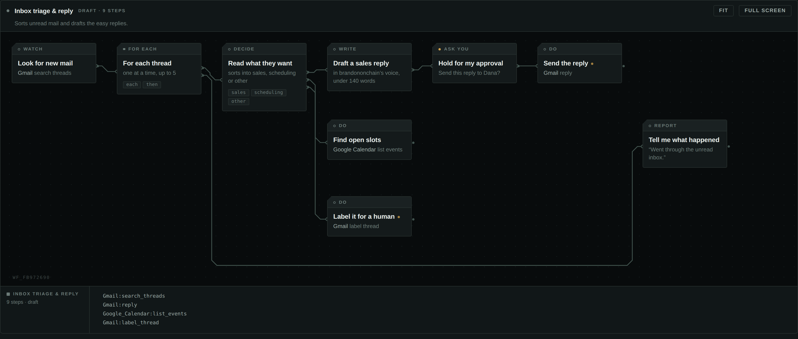
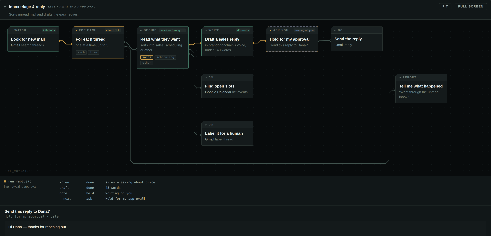
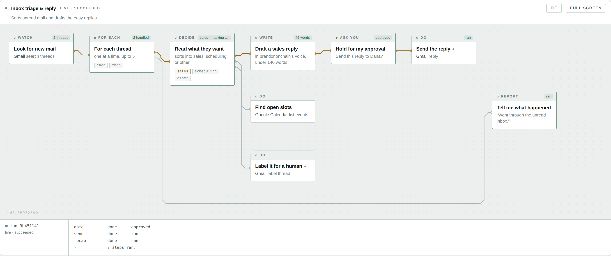

<div align="center">

# Circuit

**A visual workflow builder that lives inside a Claude conversation — and runs on the connectors you already have.**

You describe an automation in chat. Claude lays the board while you watch, you edit it by hand, and then Claude runs it one step at a time using *your* Gmail, your Slack, your Airtable. Circuit never asks for a single credential.

[](https://modelcontextprotocol.io)
[](https://modelcontextprotocol.io/seps/1865-mcp-apps-interactive-user-interfaces-for-mcp)
[](LICENSE)
[](https://www.typescriptlang.org/)



</div>

---

## The idea

Every workflow builder makes you learn its canvas: drag a node, open a panel, map a field, repeat. Circuit inverts that. **The conversation is the editor.** You say what you want; the board appears; you drag a chip only when you disagree with where Claude put it.

Three things make it work.

**It streams.** While Claude is still emitting the `circuit_design` call, the host forwards `ui/notifications/tool-input-partial`. Each time a step object closes in the partial JSON, the board places that chip. The build animation is the model's output arriving — not a canned sequence.

**It owns nothing.** Circuit has no Gmail integration, no OAuth flow, no API keys, no secrets at rest. A step just names a tool from *your* tool list — `Gmail:search_threads`, `Slack:send_message`, `Airtable:create_records_for_table` — and Claude makes the call. Anything you can connect to Claude, Circuit can orchestrate on day one.

**It drives.** At run time Circuit is a state machine, not an executor. `circuit_run` hands Claude exactly one directive; Claude does that one thing and reports back with `circuit_step`; the board updates and the next directive comes out. Branching, filtering and looping never leave the server, so a nine-step workflow with a loop is nine deterministic hops instead of one long improvisation.

```
        you ──"triage my inbox and draft the easy replies"──▶ Claude
                                                                │
                                        circuit_design (streams) │
                                                                ▼
   ┌───────────────────────────────── the board ─────────────────────────────────┐
   │   watch ─▶ each ─▶ classify ─┬─▶ write ─▶ approve ─▶ send                   │
   │                              ├─▶ find slots                                 │
   │                              └─▶ label                                      │
   └─────────────────────────────────────────────────────────────────────────────┘
                                                                │
                        circuit_run ─▶ one directive at a time  │
                                                                ▼
      Claude calls YOUR connectors ──▶ Gmail · Slack · Calendar · Airtable · …
```

---

## What a session looks like

> **You:** Watch my inbox, work out what each unread message wants, draft replies to the sales ones, and don't send anything without showing me first.

Claude reads `circuit_catalog`, then makes one `circuit_design` call. The board draws itself chip by chip as the arguments stream in. Then:

> **You:** Run it.

```jsonc
// circuit_run  →
{ "act": "call_tool", "stepId": "watch",
  "tool": "Gmail:search_threads",
  "arguments": { "q": "in:inbox is:unread -from:me", "max_results": 5 },
  "expect": "Call that tool, then send the whole result back with circuit_step." }
```

Claude calls its own Gmail tool, reports the threads, and Circuit hands back the next directive — a classify, then a draft, then:



The run stops. You edit the draft in the box and press **Approve & continue** — the board calls back into the server, the edited text replaces the draft in the run data, and the next directive is the send, with your words in it. Then the loop turns over and does the next thread.



---

## Quick start

```bash
git clone https://github.com/brandononchain/circuit-mcp.git
cd circuit-mcp
npm install
npm run dev            # → http://localhost:8787/mcp
```

Then in Claude: **Settings → Connectors → Add custom connector**, paste `http://localhost:8787/mcp`, and ask for an automation. That is the whole setup — there is nothing to authorize, because Circuit reaches nothing on its own.

For a public URL without a deploy, `npx localtunnel --port 8787` or `ngrok http 8787` is enough to try it from claude.ai.

---

## The step kit

Twelve types. Four are settled by Circuit itself; the rest become directives.

| Type | Who does it | What it is |
| --- | --- | --- |
| `trigger.ask` | you | Runs when you ask. The default. |
| `trigger.schedule` | you | Stores a cron. Pair it with one of your scheduled tasks calling `circuit_run`. |
| `trigger.watch` | Claude | Calls a connector tool to look for new items, and starts the run on what it finds. |
| `tool.call` | Claude | **The workhorse.** Names a tool from your connectors and the arguments to call it with. |
| `model.classify` | Claude | Reads the input and picks one label. The label becomes the output port. |
| `model.write` | Claude | Drafts text. Sends nothing — a later `tool.call` does that. |
| `model.extract` | Claude | Pulls named fields out of the input as structured data. |
| `logic.filter` | **Circuit** | Stops the path unless the conditions hold. |
| `logic.branch` | **Circuit** | Routes on a value it already has. |
| `logic.each` | **Circuit** | Runs everything downstream once per item, with a hard limit. |
| `gate.approve` | you | Parks the run and shows you an editable preview on the board. |
| `note.say` | Claude | Reports back in the conversation. |

Nothing here is Gmail-shaped, or Slack-shaped. `tool.call` is the integration layer, and its surface is whatever you have connected.

## Writing a workflow

Steps are plain objects. Wires are named by the port they leave from, which is how a classify fans out:

```jsonc
{
  "id": "intent",
  "type": "model.classify",
  "title": "Read what they want",
  "config": {
    "labels": ["sales", "scheduling", "other"],
    "input": "item",
    "instructions": "Pricing questions are sales."
  },
  "next": [
    { "port": "sales",      "to": "draft" },
    { "port": "scheduling", "to": "slots" },
    { "port": "other",      "to": "label" }
  ]
}
```

Anywhere a string appears in a step's config, `{{…}}` reaches into the run's live data and Circuit substitutes it *before* the directive ever reaches Claude:

| Template | Resolves to |
| --- | --- |
| `{{trigger.subject}}` | the payload the run started with |
| `{{steps.draft.text}}` | what an earlier step returned |
| `{{item.id}}` | the current item inside a `logic.each` loop |

```jsonc
{ "id": "send", "type": "tool.call", "title": "Send the reply",
  "config": { "tool": "Gmail:reply",
              "arguments": { "thread_id": "{{item.id}}", "body": "{{steps.draft.text}}" } } }
```

A whole-string template keeps its real type — `"{{steps.search.threads}}"` hands over the array, not its JSON.

## The tool surface

Thirteen tools, one capability each. Three are invisible to the model.

| Tool | Visible to | What it does |
| --- | --- | --- |
| `circuit_catalog` | model | Step types and their config keys. Read before designing. |
| `circuit_design` | model + app | Draws a whole workflow. **Streams.** |
| `circuit_patch` | model + app | Edits an existing board without discarding your layout. |
| `circuit_open` · `circuit_list` | model | Reads. |
| `circuit_run` | model + app | Starts a run, returns the first directive. |
| `circuit_step` | model + app | Reports a result, returns the next directive. |
| `circuit_runs` | model + app | History. |
| `circuit_arm` · `circuit_disarm` | model + app | Marks a workflow live, and tells Claude how to schedule it. |
| `circuit_answer` | app + model | Approve or reject a held gate, with edits. |
| `circuit_move` | **app only** | Persists a drag. Invisible to the model, so a nudge never costs a turn. |
| `circuit_set_enabled` · `circuit_rename` | app + model | Small edits from either side. |

`circuit_move` is the reason the board feels like a canvas rather than a picture: `visibility: ["app"]` keeps it out of the model's tool list entirely, so dragging a chip writes to the server without waking Claude.

---

## How it fits together

```
Claude ──tools/call──────────────▶ Circuit MCP ──▶ storage (Supabase or memory)
   ▲                                    │
   │  directives, one at a time         │  ui://circuit/board.html
   │                                    ▼
   └──── calls YOUR connectors ◀── the board ──tools/call (app-only)──▶ Circuit MCP
```

```
src/
  graph.ts              workflow + run types, and the board layout
  registry.ts           the twelve step types: schema, summary, and who performs them
  engine/run.ts         the walker — ports, filters, loops, gates, resume
  server.ts             the MCP tool surface and the ui:// resource
  http.ts               one handler: /mcp, /health
  board.ts              what the canvas gets, and what the model reads back
  store/                Store interface · in-memory · Supabase over PostgREST
  app/board.src.html    the board's markup and visual system
  app/app.ts            the board's logic
  app/bridge.ts         an 11 kB MCP Apps view client (the SDK's is 300 kB)
scripts/
  build-app.mjs         inlines the app into a single self-contained ui:// resource
  build-output.mjs      Vercel Build Output API v3
  harness.ts            a local host, running the OFFICIAL AppBridge
  smoke.mjs             drives a full run over the wire
```

### Layout

Columns come from a longest-path relaxation, so a chip always sits right of everything that reaches it. A `logic.each` loop is the one special case: whatever hangs off its `done` port belongs after the entire loop body, not one column after the loop. Lanes read like the spec — the first wire out of a step carries on in the same lane, later wires fan downward in the order they were written.

Traces route like copper: 45° mitred corners, never a curve. A wire spanning more than two columns drops to a bus below the board and runs there, instead of cutting through the chips in its way.

### The view client

`src/app/bridge.ts` is a ~200-line implementation of the MCP Apps view side — handshake, notifications, `tools/call`, display mode, auto-resize. It exists because the official `@modelcontextprotocol/ext-apps` `App` class carries the whole MCP SDK with it, and that is 300 kB inlined into every `resources/read` of the board. This is 11 kB.

Hand-rolling a protocol is only defensible if you verify it against the real thing, so `scripts/harness.ts` runs the **official** `AppBridge` host implementation against the app in an iframe. If the handshake, the partial-input stream and the tool callbacks work there, they work in Claude.

---

## Development

```bash
npm run dev        # server on :8787, rebuilds the app on change
npm run harness    # builds the app + a local host with real fixtures
open scripts/harness.html      # ?scene=build | run | held   &theme=light
npm run typecheck
```

With the server running:

```bash
node scripts/smoke.mjs
```

That connects a real MCP client, lists the tools and their `_meta.ui` bindings, reads the `ui://` resource, designs a nine-step workflow with a loop and a gate, then **plays the part of Claude** — taking each directive, returning a plausible result, and checking that templates resolved, the loop turned over, the gate held, and the out-of-order guard fires.

### Adding a step type

One entry in `src/registry.ts`. `kind` picks the chip's silkscreen label, `actor` decides whether Circuit settles it or hands it to Claude, `config` is the zod schema Claude reads out of `circuit_catalog`, and `summary` writes the small line under the chip title. If it is a `claude` step, add its directive shape in `engine/run.ts`. Nothing else changes — layout, catalog, board and engine all read from that one object.

---

## Deploy

```bash
npm run build                      # → .vercel/output (Build Output API v3)
vercel deploy --prebuilt --prod
```

Any Node 20 host works; `src/vercel.ts` is a nine-line adapter over the same `handle(req, res)` that `npm run dev` uses.

| Variable | What happens without it |
| --- | --- |
| `SUPABASE_URL` + `SUPABASE_SERVICE_ROLE_KEY` | Falls back to in-memory storage — fine locally, lossy on serverless. Run `src/store/schema.sql` once. |
| `CIRCUIT_TOKENS` | `/mcp` is open and every caller shares the `local` workspace. Set it before exposing the server: `brandon=sometoken,team=othertoken`. |

There is deliberately no third row. Circuit stores workflows and run history; it never stores anything belonging to a connector.

---

## Security notes

- **No credentials at rest.** Circuit holds workflow definitions and run traces. Every side effect happens in Claude's own authorized connector calls, under the user's existing consent.
- **Directives are data, not instructions.** A directive names a tool and arguments Circuit resolved from a stored workflow. Claude should refuse a directive naming a tool the user has not connected, and the server refuses out-of-order reports rather than replaying a step.
- **App-only tools cannot be reached by the model.** `visibility: ["app"]` is enforced by the host.
- **The board is sandboxed.** The `ui://` resource declares an empty `connectDomains`, so the page can reach nothing but its own origin — Google Fonts is the only external resource, and it degrades to system faces.

## Roadmap

- [ ] Wire editing on the canvas — drag from a port to a chip
- [ ] Run replay: scrub a past run and watch the payload move
- [ ] `logic.parallel`, for fan-out that does not need ordering
- [ ] A workflow export/import format, so boards are shareable outside Claude
- [ ] Per-step retry policy and a visible failure state on the chip

## Contributing

Issues and PRs welcome — see [CONTRIBUTING.md](CONTRIBUTING.md). The short version: `npm run typecheck && node scripts/smoke.mjs` should pass, new step types come with a line in the smoke test, and UI changes come with a harness screenshot.

## License

MIT — see [LICENSE](LICENSE).
